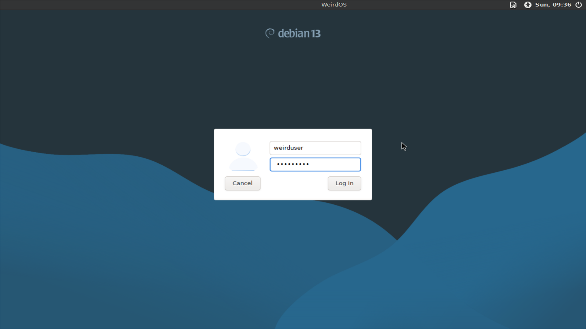
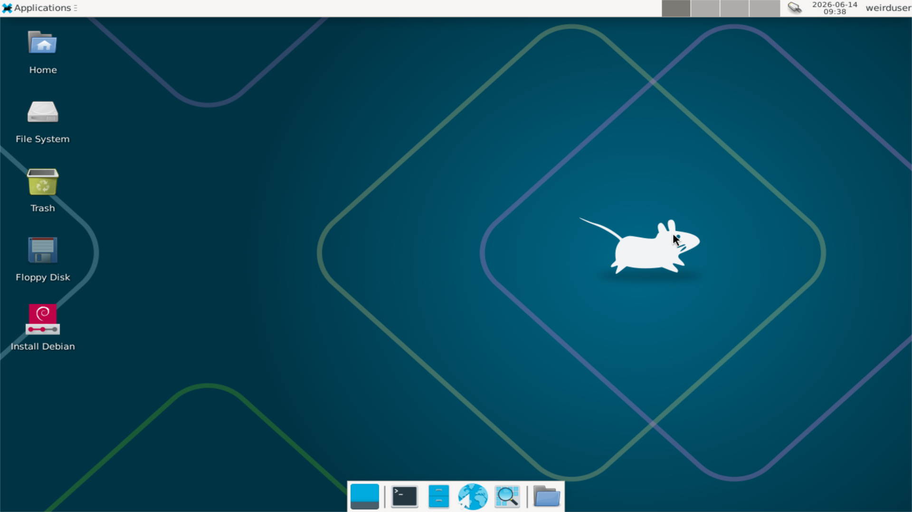
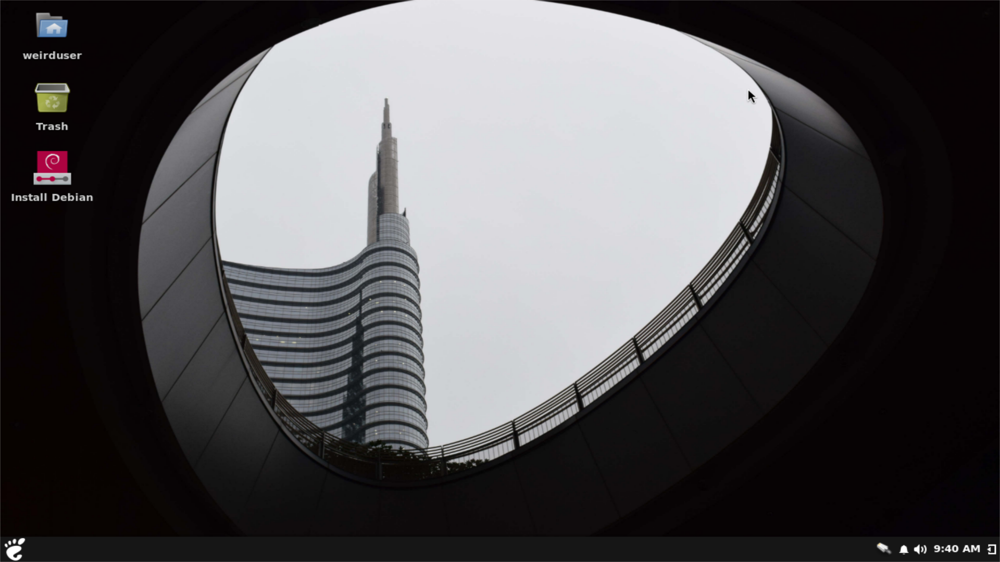
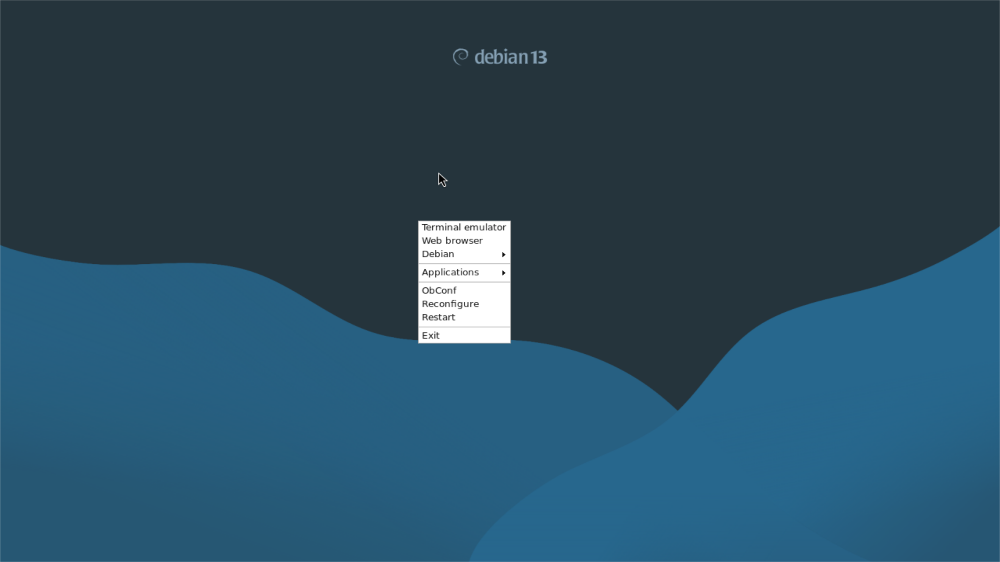

# WeirdOS
It's a weird open-source operating system. You can take the source code and make corrections. WeirdOS project licensed under GPLv3. WeirdOS Based on Debian Linux.
# WeirdOS 2 STABLE Released!
You can download it from www.weirdos.net.tr/download.html

### LightDM - Lock Screen

(User name: weirduser , password: weirduser)

### Desktop Environment: XFCE

### Desktop Enviroment: Budgie

### Desktop Enviroment: Openbox

